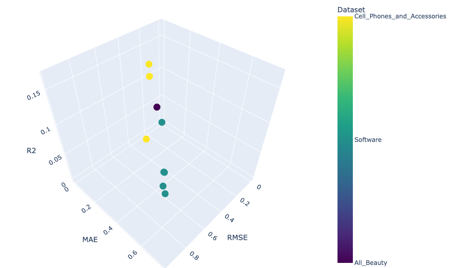
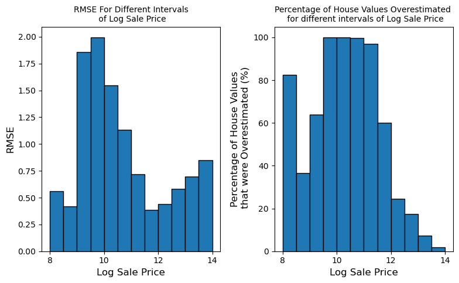
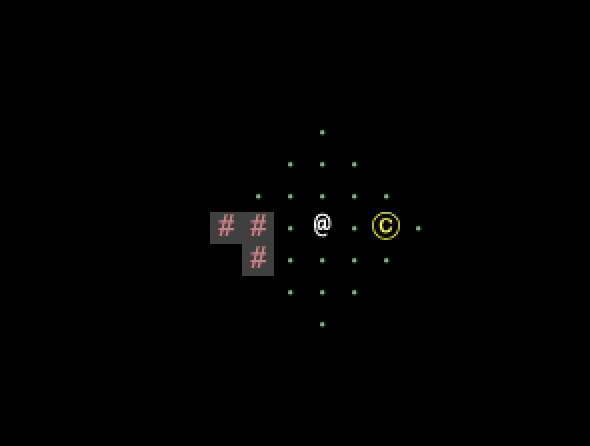
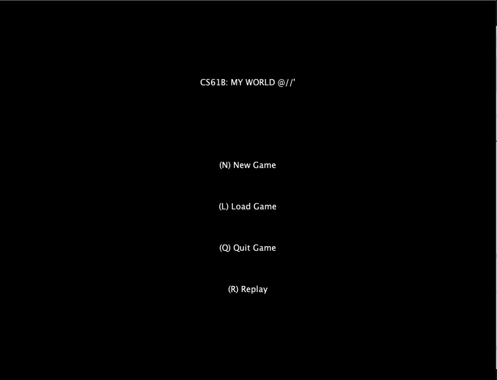

# ⚡ Welcome to my space! 

<table>
  <tr>
    <td width="30%" valign="top">
      
        
      

        📍 <b>Berkeley, CA</b> 
        🎓 <b>UC Berkeley '27</b>
      

    </td>
    <td width="70%" valign="top">
      <h1>Hi, I'm Baijian 👋</h1>
      

        I'm a <b>Data Science</b> major and <b>Computer Science</b> minor at UC Berkeley. 
        I love the intersection of robust backend systems and intelligent data pipelines. 
        When I'm not stuck in <b>CS 189</b> (Machine Learning) or <b>CS 161</b> (Security), you can probably find me hunting for the best coffee in Berkeley or taking a long walk to clear my head.
      

      

        🌱 <b>Currently:</b> Learning how to build smarter models and more secure software. 
        🚀 <b>Goal:</b> Creating tools that actually help people, while keeping the complex "math stuff" under the hood.
      

      

        
      

    </td>
  </tr>
</table>

---

## 🛠️ My Toolbox

### 💻 Programming & Systems

### 📊 Data Science & AI

---

## 📂 Project Showcase

### 🌟 Amazon Review Multi-Modal Prediction: Evaluation & Trade-off Analysis
> **Stack:** Python, BERT, XGBoost, Bayesian Ridge, Performance Benchmarking
- **Role:** Evaluation & Interpretability Lead (Team of 3 for Data 144).
- **Contributions:** Designed the benchmarking pipeline across 800K+ records, evaluating trade-offs between text-only (BERT/TF-IDF) and multi-modal (Image + Text) architectures.

<table>
  <tr>
    <td width="55%" valign="top">
      <b>Algorithm Benchmarking & Cost-Benefit Analysis</b> 
      I managed the model evaluation strategy, fine-tuning ensembles (XGBoost, LightGBM) across diverse datasets (e.g., Software, Beauty, Cell Phones).   
      A key engineering insight I uncovered was the <b>accuracy vs. compute trade-off</b>. While our multi-modal Bayesian Ridge model (integrating visual features) achieved the best predictive performance (Train MSE: 0.289), it incurred massive computational overhead (over 1.4 hours for 300 iterations). By benchmarking this against our BERT/TF-IDF text-only pipelines, I demonstrated how lighter models could achieve highly competitive RMSE scores at a fraction of the compute cost—a critical consideration for scalable, real-world deployments.
    </td>
    <td width="45%" valign="top">
      <b>Model Interpretability (Explainable AI)</b> 
      Beyond raw metrics, I took ownership of decoding the "black-box" predictions. I generated comprehensive visual analyses to explain exactly how interacting features influenced a review's "helpfulness" score. This ability to translate complex model behaviors into human-readable insights was vital for validating our architecture's logic.  
      
    </td>
  </tr>
</table>

### 🏠 Cook County Housing Analysis: Predictive Modeling & Fairness Audit
> **Stack:** Python, Scikit-learn, Pandas, Matplotlib, EDA
- Engineered a robust machine learning pipeline to forecast property values across Cook County using **500K+** real estate records.
- Achieved strong baseline predictive accuracy through iterative feature engineering and exploratory data analysis (EDA).

<table>
  <tr>
    <td width="55%" valign="top">
      
    </td>
    <td width="45%" valign="top">
      <b>Algorithmic Fairness & Bias Detection</b> 
      Rather than solely focusing on top-line accuracy, I conducted a critical audit of the model's error distribution. As the visualizations reveal, the assessment process exhibits a systemic regressive bias.   
      The left-hand chart clearly demonstrates that the model systematically <b>overvalues inexpensive properties</b> (with overestimation rates nearing 100% for lower-log-price tiers) while <b>undervaluing expensive properties</b>. This insight is crucial for understanding the real-world socio-economic impact of deploying flawed predictive models in public policy and property taxation.
    </td>
  </tr>
</table>

### 🎮 2D Game Engine: Dynamic World Generation & Exploration
> **Stack:** Java, Data Structures, Algorithms (DFS, Dynamic FOV), Event Handling
- Architected and implemented a fully-functional 2D tile-based game engine from scratch (CS 61B style).
- Engineered a dynamic world generation pipeline ensuring unique, navigable mazes for every playthrough.
- Developed core gameplay mechanics, including user input systems, inventory/scoring (coin collection), and win/loss conditions.
<table>
  <tr>
    <td width="50%" valign="top">
      <b>Dynamic Field of View (Fog of War)</b> 
      Implemented DFS-based maze generation with dynamic line-of-sight mechanics. As shown, the player (<code>@</code>) is restricted to a limited illuminated radius and must navigate the dark, randomized maze to collect all the coins (<code>C</code>) to win.  
      
    </td>
    <td width="50%" valign="top">
      <b>System Interface & Replay Mode</b> 
      Beyond standard save/load features, the core technical highlight is the input sequence capture system. Players can select the <code>(R) Replay</code> option from the main menu to perfectly reconstruct and watch their previous playthroughs step-by-step.  
      
    </td>
  </tr>
</table>
